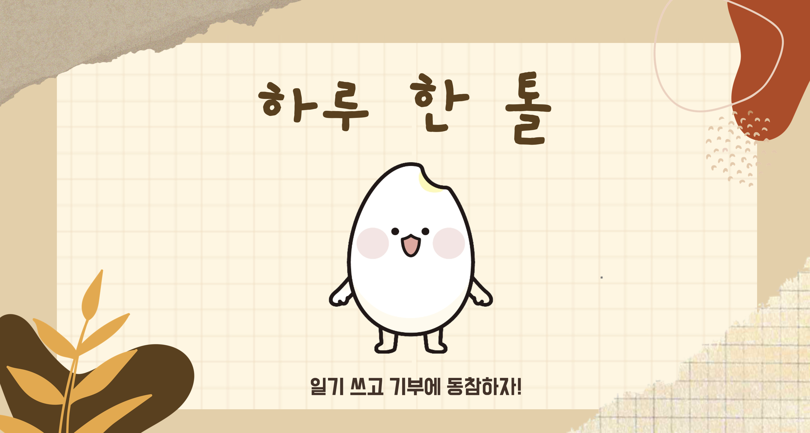
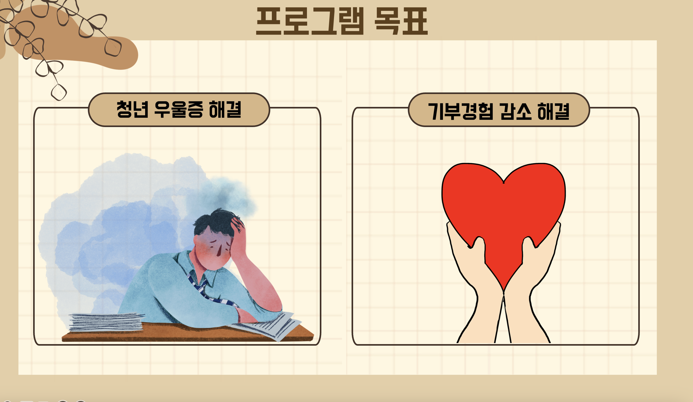
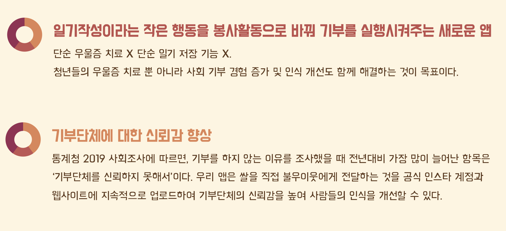
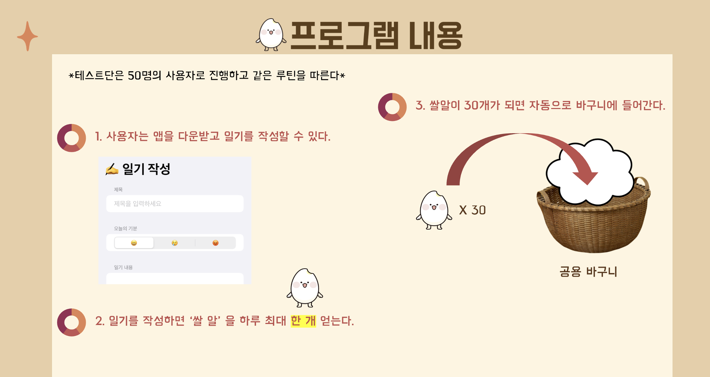
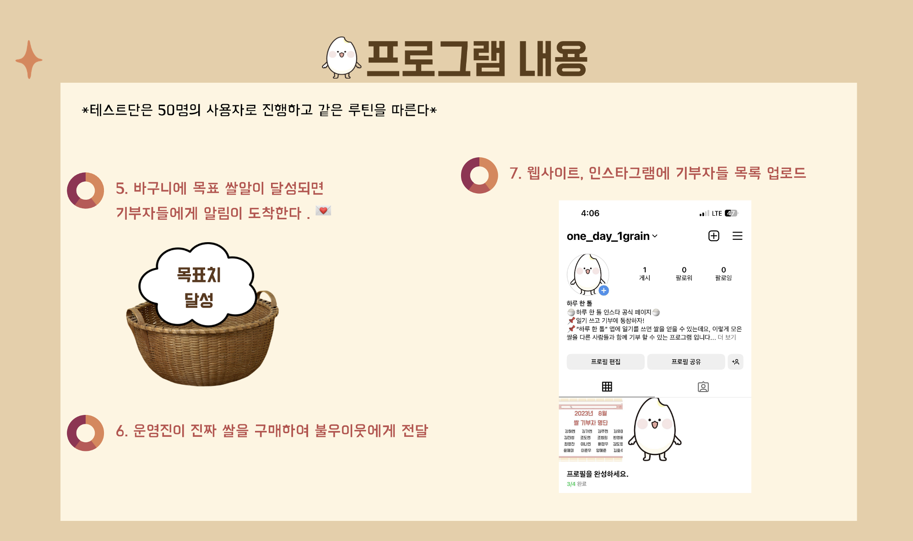
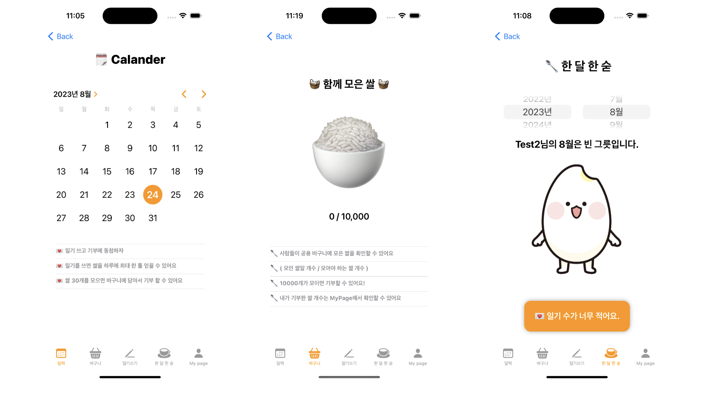
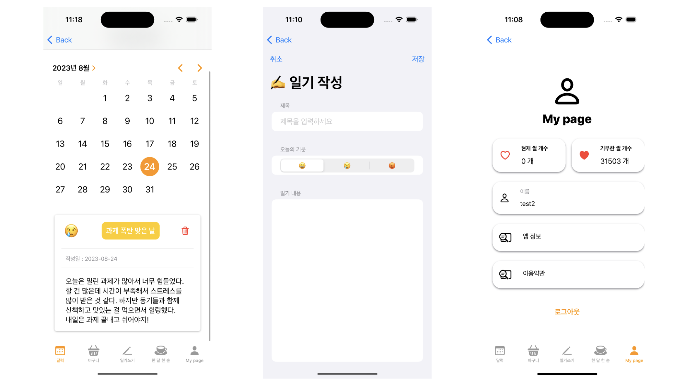
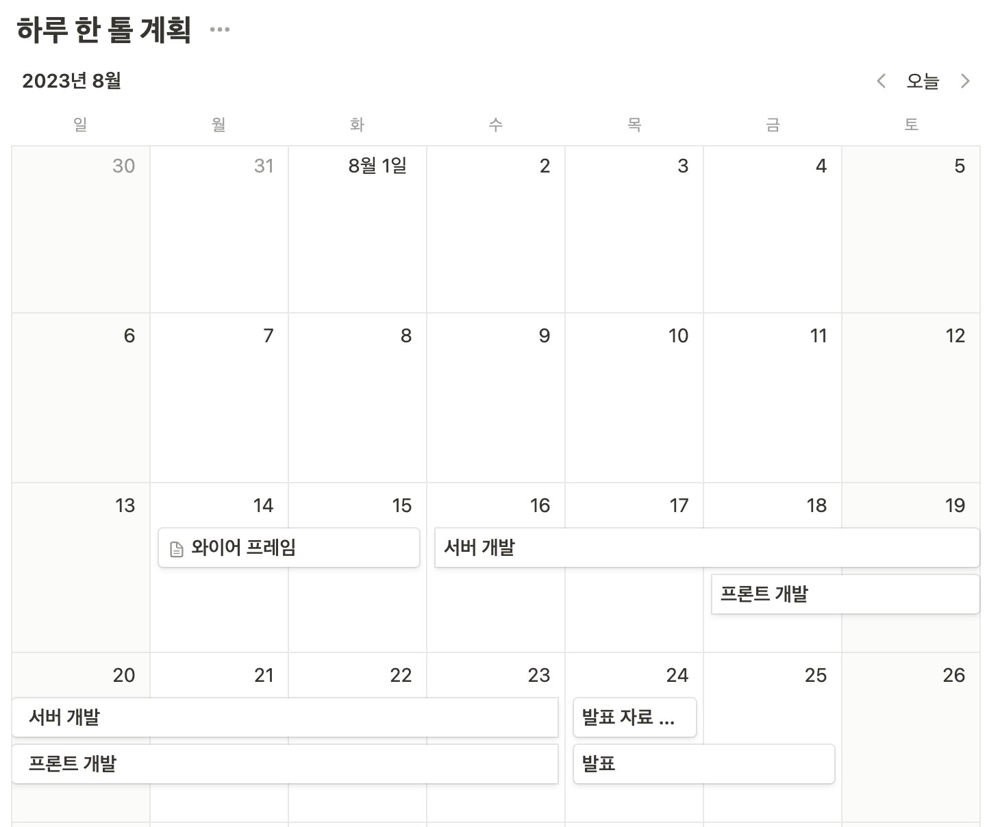

# 🍚  하루 한 톨  🍚

일기쓰기와 쌀 기부를 통해
대학생들이 시간을 투자하여 쉽게 사회에 공헌할 수 있는 서비스를 제공합니다.

+ 일기를 쓰면 쌀을 하루에 최대 한 톨 얻을 수 있는데요, 이렇게 모은 쌀을 다른 사람들과 함께 기부 할 수 있는 프로그램 입니다.
+ 쌀이 일정량 모이면 쌀을 보낸 사람들의 이름으로 기부를 합니다. 
  ( 본 프로젝트는 제 4회 대학생 나눔봉사 해커톤 수상작으로, 실제 서비스를 제공하지 않습니다. )

## 📌 프로그램 목표

## 📌 프로그램 내용

## 📱 앱 실행화면

* ✍️ 일기쓰기 
  * 오늘 느꼈던 감정이나 있었던 일들을 기록하고 쌀을 하나 얻습니다.
* 🥄 한 달 한 숟  
  * 한 달 동안 느꼈던 감정들을 분석해서 사용자에게 위로의 말이나 격려의 말을 보여줍니다.
  * 한 달 동안 모은 쌀을 🧺 공용 바구니에 넣을 수 있습니다.
* 🧺 공용 바구니
  * 사람들이 공용 바구니에 모은 쌀을 확인할 수 있습니다 ex) 1,470 / 1,500

## ✍️ 일기쓰기 

## 🥄 한 달 한 숟

## 👩🏻‍💻 기술 스택 

<h4>Frontend</h4> 

 
   
   

<h4>Backend</h4>

 

## Team Member
|성명|소속|Role| Github
|------|----|-------|---|
|김주현|중앙대학교 소프트웨어학부|Dev(Frontend)|<a href="https://github.com/JooHyeonKim?tab=repositories">
|조도연(PM)|중앙대학교 소프트웨어학부|기획, Dev(Backend)|<a href="https://github.com/ysndy">
|조범희|중앙대학교 소프트웨어학부|Dev(Backend)|<a href="https://github.com/ChoBeomHee">

## 🗓️ 개발 기간
2023.7.29 ~2023.8.25  

